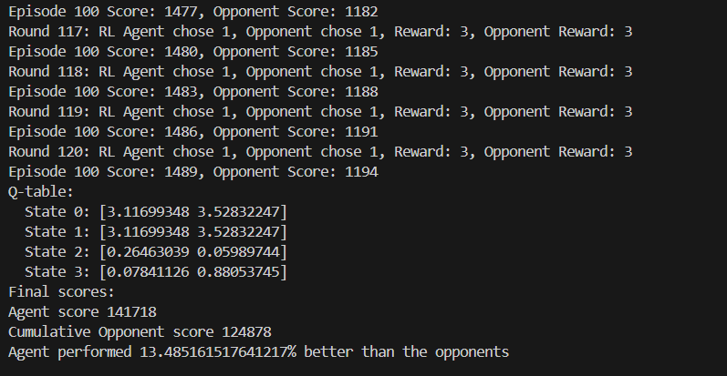

# Prisoner's Dilemma -- Reinforcement Learning

## Overview
This project implements the classic **Prisoner's Dilemma** game using both definite strategy agents and a reinforcement learning (RL) agent. The goal is to hold a competition between different agents, where five agents follow definite strategies, and the sixth agent learns the optimal strategy through reinforcement learning.

The definite strategy agents include:
- Always cooperate
- Always betray
- Tit For Tat
- Deflect once for 3 betrayals
- Random action

The RL agent uses the Q-learning algorithm to learn and adapt its strategy based on the outcomes of previous actions.

## Organization
- **definite_agents.py**: Contains code for the dumb agents.
- **RLagent.py**: Contains code for the RL agent.
- **environment.py**: Contains code defining the game environment.
- **tournament.py**: Contains the code to initialize each component of the game and makes use of the predefined environment to moderate the tournament.

## Requirements
- numpy
- pandas

## Usage
Once you've ensured the required packages are installed in your environment, go ahead and run the tournament.py file to find a line by line log of each agent's performance in each round of each epoch followed by a final score. The agent does win in most cases as expected.

# Results
Running the environment for a considerable number of episodes, I could clearly see that the agent performed vastly better than the cumulative performance of all the dumb agents. I am still in the process of finding the best way to extract the best strategy(something that can be expressed in a conversation for example) from the Q-table. I will update the code as soon as I land on something that works well. So far the agent has been able to learn the best strategy and has been able to outperform the other agents in most cases.

# Future Work
- Extract the best strategy from the Q-table
- Add more agents
- Add noise in communication between agents

## License
This project is licensed under the MIT License - see the [LICENSE](./LICENSE) file for details

